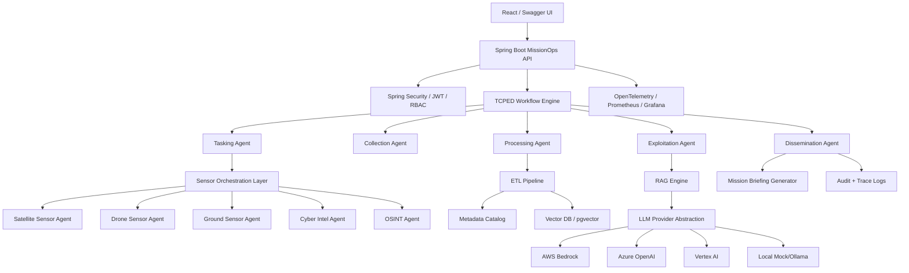
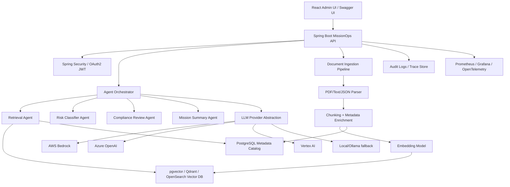

# missionops-ai-orchestrator
## Java/Spring Boot MissionOps AI platform for DLP endpoint security, Sensor Fusion, TCPED workflows, Space-Cyber Mission Intelligence, Metadata Cataloging, RAG and synthetic LEO anomaly triage.

DISCLAIMER:
This project is a synthetic, unclassified, educational portfolio simulation. It is not an operational command-and-control system. It does not connect to real sensors, drones, satellites, classified systems, or weapons systems. All scenarios, documents, events, and data are mock examples designed to demonstrate Java/Spring Boot, AI/RAG, multi-agent orchestration, metadata cataloging, secure APIs, and DevOps architecture patterns.

## Phase 1 scope clarity
### Implemented in Phase 1
- Multi-module Maven project structure with `missionops-api` as the runnable Spring Boot app.
- Mock runtime profile and local run path without cloud AI credentials.
- Mock endpoints for ask/simulation/audit/health and a stub document upload endpoint.
- Flyway baseline migration for core table names.
- Basic Dockerfile/Compose and CI scaffold.

The current repository contains a runnable mock/local MVP for MissionOps AI Orchestrator.
Implemented and validated:
- Java 21 / Spring Boot 3.x multi-module Maven baseline
- `missionops-api` as the runnable Spring Boot app
- Mock RAG-style ask endpoint
- Synthetic ISR Event Triage endpoint
- `UNKNOWN_OBJECT_DETECTED` simulation scenario
- Audit trace lookup
- AI health endpoint
- Swagger UI and Actuator health
- Flyway baseline migration
- Dockerfile, Docker Compose, and GitHub Actions scaffold
- README architecture diagrams and implementation status audit

### Scaffolded for future extension
- Library modules: `missionops-rag`, `missionops-agents`, `missionops-ingestion`, `missionops-catalog`, `missionops-tcped`, `missionops-sensors`, `missionops-worldmodel`, `missionops-geospatial`, `missionops-simulation`, `missionops-common`.
- Provider profile files for OpenAI/AWS Bedrock/Azure/Vertex/GovCloud template.

### Planned for Phase 2+
- Full Spring AI integration and RAG provider abstraction implementations.
- LangChain4j-style multi-agent orchestration internals.
- TCPED workflow APIs and persisted timeline/reporting.
- Sensor orchestration and tasking APIs.
- DLP alert triage
- NIST/CIS-style compliance mapping
- Space-domain awarness simulation module
- Catalog/ontology/world model/geospatial APIs and vector store abstraction with pgvector-backed retrieval.
- Hardened security, compliance automation, and production observability depth & audit ready reporting enhancements.

These diagrams show the target architecture and scaffolded direction.
Phase 1/1.5 only implements mock/local demo behavior.
Full TCPED persistence, real sensor orchestration, Spring AI integration, pgvector retrieval, endpoint security, DLP, and compliance mapping remain planned for later phases.

## Architecture Diagrams
The diagrams below show the target architecture and scaffolded direction for the MissionOps AI Orchestrator. Phase 1/1.5 implements a mock/local MVP path, while deeper implementations are planned in later phases.

### MissionOps TCPED + Sensor Orchestration View


### RAG + Agent Orchestration View


## Phase-Wise Implementation Plan
- **Phase 1: Runnable MVP Foundation**
- **Phase 1.5: Synthetic ISR Event Triage Mock Demo**
- **Phase 2: Endpoint Security, DLP, Compliance, and SDA Simulation**
- **Phase 3: Real RAG Provider Abstraction and Vector Store**
- **Phase 4: Production Hardening and Observability**

## Demo Scenario: Synthetic ISR Event Triage
Endpoint:
- `POST /api/v1/simulation/events`

Expected behavior (mock/local):
- Accepts a synthetic ISR-style event payload.
- Returns deterministic Phase 1.5 mock response with mission ID, TCPED stage, recommended actions, activated agents, risk level, initial briefing, and trace ID.
- Generates an in-memory audit trace retrievable via `GET /api/v1/audit/traces/trace-isr-demo-001`.

## Local validation (no cloud credentials required)
Use Java 21 and Maven 3.9+.

```bash
mvn -version
mvn clean verify -q
mvn -pl missionops-api spring-boot:run -Dspring-boot.run.profiles=mock
```

Then verify:
- Swagger UI: `http://localhost:8080/swagger-ui.html` (or `/swagger-ui/index.html`)
- Actuator health: `http://localhost:8080/actuator/health`
- AI health: `http://localhost:8080/api/v1/health/ai`

Run demo scenario:
```bash
curl -X POST http://localhost:8080/api/v1/simulation/scenarios/UNKNOWN_OBJECT_DETECTED/run
```
Run Synthetic ISR Event Triage:
```bash
curl -s -X POST http://localhost:8080/api/v1/simulation/events \
-H "Content-Type: application/json" \
-d '{"eventType":"UNKNOWN_OBJECT_DETECTED","domain":"SPACE","location":{"latitude":38.8339,"longitude":-104.8214,"altitudeKm":550},"source":"SATELLITE_SENSOR","confidence":0.72}'
```
Audit trace check:
```bash
curl -s http://localhost:8080/api/v1/audit/traces/trace-isr-demo-001
```
# Notes on Codex environment
If Maven Central access is restricted in the execution environment, dependency download may fail even with correct POM setup. In that case, run the commands above in a normal local developer environment with internet access.

# Project Talking Points
- Built a Java/Spring Boot AI platform for secure mission document intelligence.
- Implemented a Phase 1 mock RAG interaction with citations and audit trace output.
- Added Phase 1.5 synthetic ISR event triage mock endpoint and traceability flow.
- Set up foundation modules for TCPED, sensors, catalog, world model, and geospatial evolution.
- Added baseline schema migration, container scaffolding, and CI validation path.
- Kept all demo data synthetic/unclassified for safe portfolio presentation.

### Phase 1 Validation
```bash
mvn clean verify -q

✅ Passed
mvn -pl missionops-api spring-boot:run -Dspring-boot.run.profiles=mock

✅ App started successfully with mock profile
curl -s http://localhost:8080/actuator/health

✅ Returned: {"status":"UP"}
curl -s -o /dev/null -w '%{http_code}' http://localhost:8080/swagger-ui/index.html

✅ Returned: 200
curl -s -X POST http://localhost:8080/api/v1/simulation/scenarios/UNKNOWN_OBJECT_DETECTED/run

✅ Returned expected mock mission response with:
missionId
currentStage
riskLevel
briefing
agentsUsed
citations
traceId
curl -s -X POST http://localhost:8080/api/v1/simulation/events \
  -H "Content-Type: application/json" \
  -d '{"eventType":"UNKNOWN_OBJECT_DETECTED","domain":"SPACE","location":{"latitude":38.8339,"longitude":-104.8214,"altitudeKm":550},"source":"SATELLITE_SENSOR","confidence":0.72}'

✅ Returned expected Synthetic ISR Event Triage response with:
missionId
tcpedStage
riskLevel
recommendedActions
agentsActivated
initialBriefing
traceId

curl -s -X POST http://localhost:8080/api/v1/ask \
  -H "Content-Type: application/json" \
  -d '{"question":"What controls are required before deploying this AI system?"}'

✅ Returned mock RAG answer with citations and traceId
curl -s http://localhost:8080/api/v1/audit/traces/trace-demo-001
✅ Returned audit trace entries for trace-demo-001
curl -s http://localhost:8080/api/v1/audit/traces/trace-isr-demo-001
✅ Returned audit trace entries for trace-isr-demo-001

